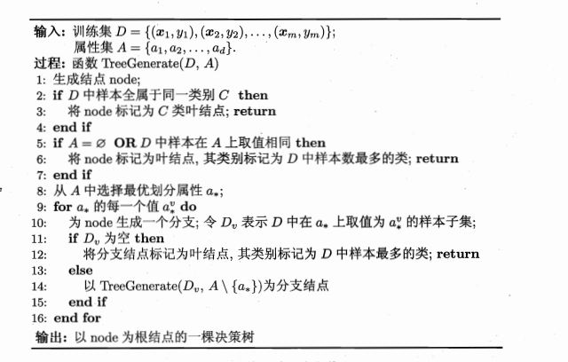

基本流程

划分选择

	- Information Gain

$$Entropy(D) = \sum_{i=1}^{k} p_{i} log_{2} p_i$$

$$Gain(D, a) = Entropy(D) - \sum \frac{|D^{v}|}{|D|} Entropy(D^{v})$$

		Gain 对于取值多的属性有偏好，会优先选出取值多的属性。为此引入了 信息增益率的概念（Gain ratio）, 信息增益率对于取值少的属性有偏好，会优先选出取值少的属性。

$$Gain\_radtio(D, a) = \frac {Gain(D, a)} {IV(a)}$$
$$IV(a) = \sum \frac {|D^v|}{|D|} log_2 {\frac {|D^v|}{|D|}}$$

	- Gini Index

$$Gini(D) = 1 - \sum {p_{i}^2}$$

$$Gini\_index(D) = \sum \frac{|D^v|}{|D|} Gini(D^v)$$

剪枝处理

	为了避免过拟合(overfitting), 需要做剪枝处理(pruning)。
    
    预剪枝：每次划分之前，在 Validate DataSet 上检验划分之前和划分之后的准确率，如果准确率有提高，那么就划分，如果没有提高，就不划分。
    
    后剪枝：对于生成的决策树中的每个非叶节点，把该节点替换为叶节点，如果替换之后，模型在 Validate DataSet 上的准确率有提高，那么就执行这种替换。

连续与缺失值

		对于连续值属性，可以选择划分点，使得对于该划分点，有尽可能大的信息增益
        如何处理缺失值？

多变量决策树