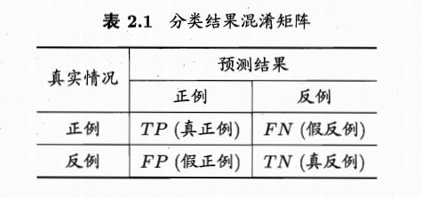
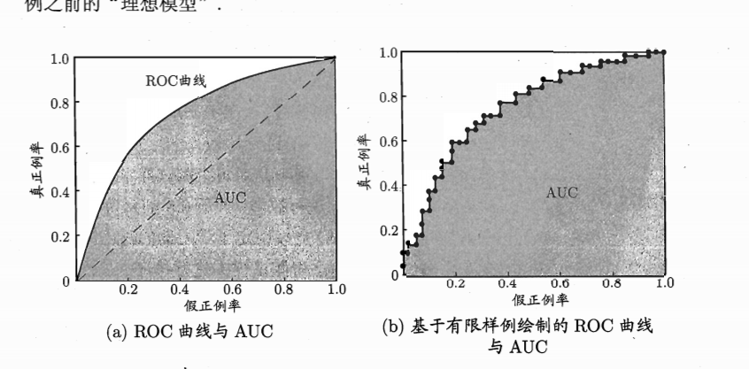
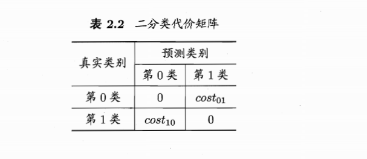
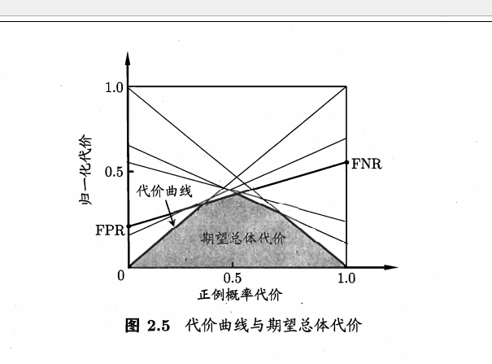

### 模型评估与选择

评估主要是评估模型的泛化误差，但是泛化误差没法直接测量，所以想根据模型在有限样本上的误差，推测模型的泛化误差。选择就是要选择使用泛化误差最小的模型。

经验误差与过拟合

留出法（leave-out）

    拿出一部分样本（训练集 Training DataSet ）训练模型，拿出一部分样本（测试集 Test DataSet ）评估模型，认为模型在 Test DataSet 上的误差，就是模型的泛化误差。

交叉验证法（Cross Validation）

	k fold cross validation 将样本等分成 k 份，每次训练拿出 k - 1 份样本作为 Training DataSet ，剩下的一份样本作为 Test DataSet 训练模型。认为模型的泛化误差是模型在所有拿来做 Test DataSet 的样本上的误差的均值。

	对于 Cross Validation 方法，我无法理解的是， k 次训练，每次都可以训练出一个模型，那么最后要使用的模型到底是那个模型。对于回归问题，是简单的对 k 个模型的预测值取平均作为最终的模型吗？

自助法（Bootstrapping）

	Bootstrapping 在把样本分成 Training DataSet 和 Test DataSet 时， Training DataSet 和 Test DataSet 都能够保持样本的总体分布。
    具体做法是，对于大小为 m 的样本集 D, 随机从 D 中选出 m 个样本（注意，一个样本可能会被选中多次）作为 Training DataSet ，没有选中的数据作为 Test Dataset 。Bootstrapping 在样本比较少时常用。
    大约会有 36.8% 的样本不会被选中（作为 Testing DataSet ），下面的数学公式证明了这一点。

$$ \lim_{m \rightarrow \infty}(\frac {1} {1 - m})^m = \frac{1}{\mathrm{e}} \approx 0.368$$

调参

    为了调参，会选出一部分样本作为 Validate DataSet (验证集)。

性能度量
	
    要估计误差，需要给出一个指标。下面介绍常用的指标。
    
    对于回归问题，常用的指标有：
    	
        - 均方误差(MSE)

        - 绝对值误差(MAE)

	对于分类问题，常用的指标有：
    	
    	- 错误率（精度 = 1- 错误率）

$$\sum_{i = 1} ^{m} \frac { \mathbb{I} (f(x_{i}) != y_{i})}   {m}$$

$$\int_{x \sim D} \mathbb{I} (f(x) != y) p(x) dx$$

		- 准确率(precision)，召回率(recall), F_1 Score, 混淆矩阵(confusion matrix)
        

        
$$Precision = \frac {TP}  {TP + FP}$$
$$Recall = \frac {TP} {TP + FN }$$

	Precision 和 Recall 是相互制约的两个量，常常需要对这两个量折中处理，得到 Precsion 和 Recall 都比较高的模型。F_1 Score 就是一种折中的指标，F_1 Score 还有带了权重的变种。
    
$$F_1 = \frac {1} {\frac {1} {Precision} + \frac {1} {Recall}}$$
$$F_\beta = \frac {1} {\frac {1} {Precision} + \frac {\beta} {Recall}}$$

		- ROC 和 AUC
            ROC 曲线的横纵轴分别是 假正例率（FPR） 和 真正例率（TPR） 。比如用 logisticRegression 做分类，模型直接预测出的是个数值，不是类号，需要设个阈值，根据预测出的数值是否大于阈值，来判断样本属于哪一类（一般都是数值大于阈值，样本就属于正例，反之属于反例）。那么阈值越大，明显TPR 和 FPR 都很变高。

$$TPR = \frac {TP} {TP + FN}$$
$$FPR = \frac {FP} {FP + TN}$$

			 AUC 就是 ROC 曲线下方的面积，就是下图中的阴影部分面积，1 - AUC 刚好等于排序损失 l_rank。根据上面的例子，理想情况下 logisticRegression 对于所有正样本的预测值应该大于 logisticRegresion 对于所有负样本的预测值。
             对于两个模型A, B，如果模型A的 ROC 曲线包着 模型B 的 ROC 曲线，那么模型A 优于模型 B。
             如果 A, B 的 ROC 曲线没有包含关系，那么一般还是选择 AUC 大的模型。

$$AUC = \frac {1} {2}  \sum_{i=1}^{m - 1} (x_{i + 1} - x_i) (y_{i + 1} + y_{i})$$

$$l_{rank} = \frac {1} { m^{+} m^{-}} \sum_{x^{+} \in D^{+}} \sum_{x^{-} \in D^{-}} (\mathbb{I}(f(x^{+}) < f(x^{-})) + \mathbb{I} (f(x^{+}) = f(x^{-})))$$

$$AUC + l_{rank} = 1$$

		- 代价曲线
			医疗诊断中，把健康人诊断成病人和把病人诊断成健康人的代价是不一样的。为此给不同错误，赋予不同的权重。比如：

			ROC 曲线默认每种错误的权重相同。代价曲线是对 ROC 曲线的改进，考虑 到不同的错误有不同的权重。
            代价曲线横纵轴分别是

$$P(+)cost = \frac {p \times cost_{01}} { p \times cost_{01}  + (1 - p) \times  cost_{10}}$$
$$cost_{norm} = \frac {FNR \times p \times cost_{01}  + FPR \times (1-p) \times cost_{10}}{p \times cost_{01}  + (1 - p) \times  cost_{10}}$$

			代价曲线，可以根据 ROC 曲线画出来，在 ROC 的每一个点，可以得到 (TPR, FPR), 可以得到 FNR = 1 - TPR， 得到一条 (0, FPR) 到 (1, FNR) 的线段。所有这些线段下方的面积就是在所有条件下学习器的期望总体代价。

比较检验（todo）
	简单地，有 Test DataSet， 有衡量错误的指标，就认为模型在测试集上的误差就是模型的泛化误差。但是统计学中的假设检验（ hypothesis test ），为衡量泛化误差提供了更好的办法。

    交叉验证中的 t-检验
    	- 

