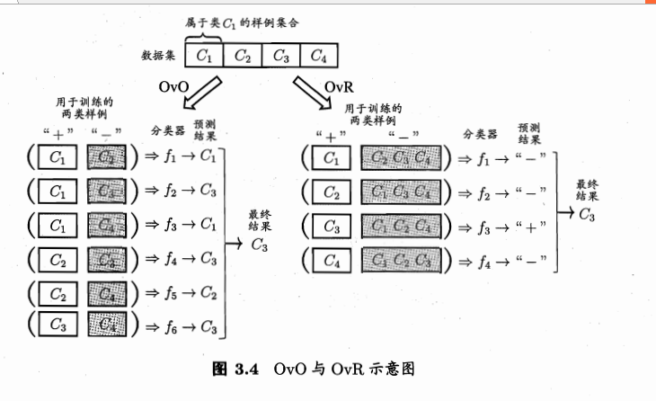
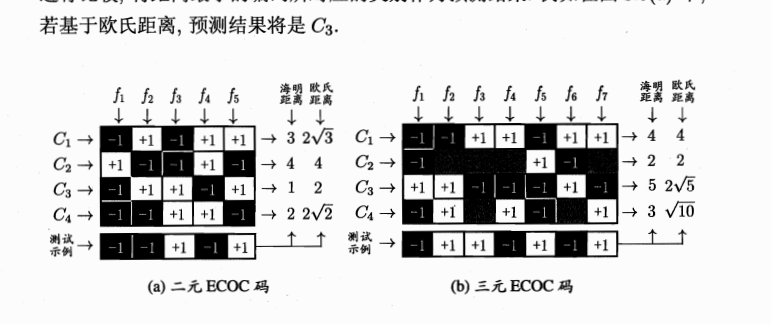

线性模型

基本形式：

$$f(\vec{x}) = \vec{w}^{T} \vec{x} + b$$

对率回归(logistic Regression)

$$In(\frac{f(\vec{x})} {1 - f(\vec{x})}) = \vec{w}^{T} \vec{x} + b; f(\vec{x}) 代表 \vec{x} 是正例的概率$$

等价于

$$f(\vec{x}) = \frac {1} { 1 + e^{-(\vec{w}^{T} \vec{x} + b)}}$$

线性判别分析， 想象把点投影到一条直线上，同类的点在这条线上很接近，异类的点在这条线上距离很远。

多类别学习

	one versus one: 见下图
    one versus rest: 见下图
    many versus many: 纠错输出码（Error Correcting Ouput Class）。

类别不平衡问题

	一般都是正样本少，负样本多，所以这里做相同的假设。
    - 直接丢弃更多的负样本(undersampling)
    - 增加正样本数（比如用 boostrapping 抽样）(oversampling)
    - 阈值移动，比如调高把正样本误判为负样本的惩罚力度

线性模型有闭解式，直接可以算出来，不过可能会有无穷多个解。

logistic Regression 的数学性质特别好（凸的，且无限可微），可以用梯度下降法求解。
使用梯度下降法求解 logistic Regression 的迭代公式为：

